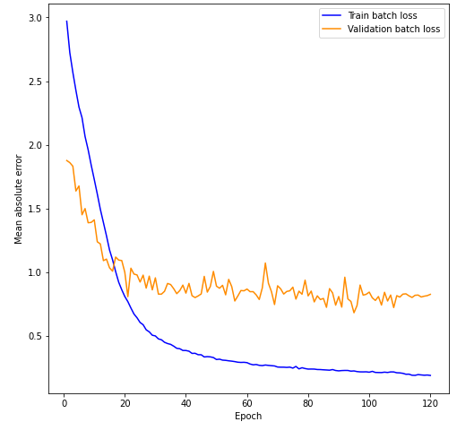
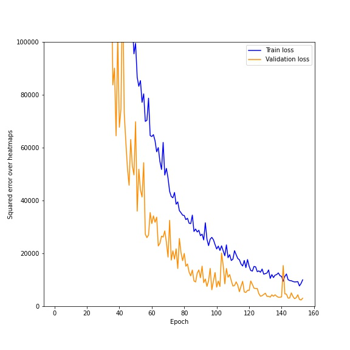
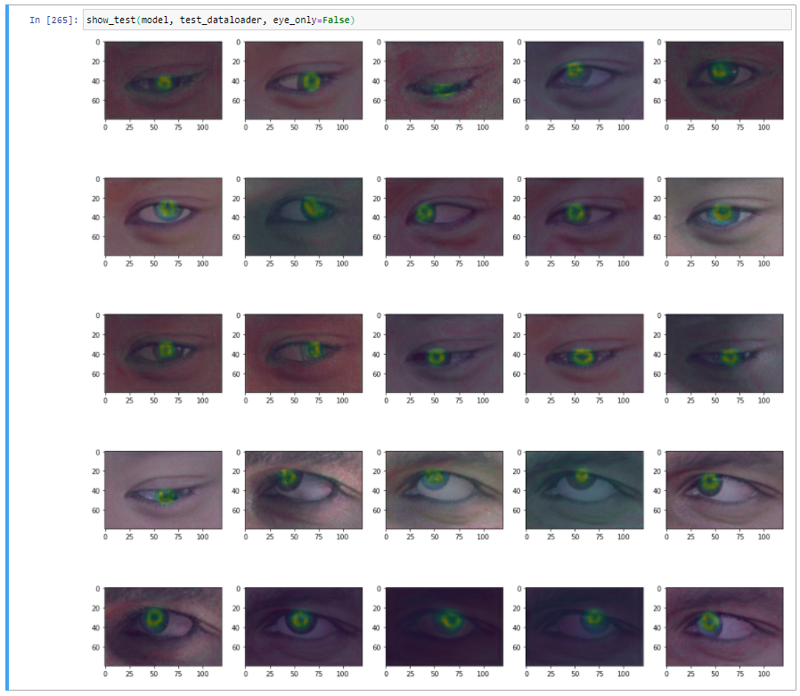

# GazeEstimation
This README contains my attempts to solve gaze estimation task.

dlib + Pytorch pipeline for gaze estimation.

`SynthesEyes.ipynb` contains step-by-step implementation of 
training environment for [SynthesEyes](https://www.cl.cam.ac.uk/research/rainbow/projects/syntheseyes/) dataset.

`Hourglass.ipynb` contains my implementation of Hourglass neural network, it's training and evaluation for pupil heatmaps extraction.

## Gaze estimation
| Model                                  | Test Error                    |   Train size/Amount of epochs |   Model size   |
|:---------------------------------------|:-----------------------------:|:-----------------------------:|:---------------|
| GazeNet (7 conv, 1 dense, w/o BN)      |           0.91                |       10240/70                |    8.7 Mb      |
| GazeNet_v2 (7 conv, 2 dense, w/ BN)    |           0.79                |       10240/70                |   15.6 Mb      |

## GazeNet (7 conv, 1 dense, w/o BN) 
Test error is quite big because it represents L1 loss with respect to euler's angles in screen space 
(yaw and pitch, reference point located at pupil center) 

## GazeNet_v2 (8 conv, 2 dense, w/ BN)
Still high test error, learning curves speak for themselves 
UPD : Legend are not right, it must be "Train loss and test loss" 

## Pupil landmarks estimation

| Model                                  | Test Error                    | Train size/Amount of epochs |   Model size   | Evaluation time |
|:---------------------------------------|:-----------------------------:|:---------------------------:|:---------------|:----------------|
| PupilNet-3Hourglass w/ BN              |              ~3000            |     10240/153               |       2 Mb     | 146 ms on pretty old InterCore-i5 CPU   |

## PupilNet-3Hourglass w/ BN

Test error is around 3000, which is actually 3000 / 32 ~ 93.75 per prediction, because I accidentally 
measured it over batch, not over single image. It means that following model gives approximately less than 0.01 error per pixel 
(because one prediction contains 8 heatmaps each of them has 80x120 pixels), which 
is enough to predict valuable heatmaps.

Actual heatmaps of pupil landmarks : 

## ToDo

• <s> Use pupil features given in the dataset </s> 

• Implement pupil center detection using another dense layer (probably it is just weighted softmax of all heatmaps?)

• Apply augmentation <s> <b> only if </b> model works bad during inference time </s> 

Just took a look at learning curves, model is too weak, so
I think we need stronger feature extraction

• <s> Implement hourglass </s> 

• Explain hourglass error

• Implement softmax over heatmaps in order to predict landmarks coordinates
