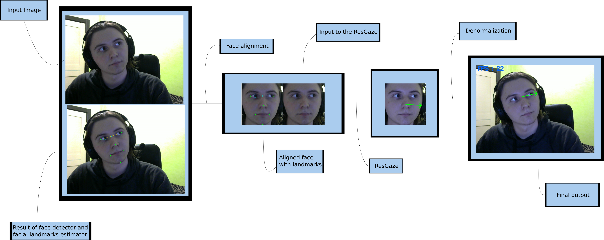

# GazeEstimation
## Demo

First run ```pip install -r requirements.txt``` to install all necessary modules to run the demo (you may change it if you don't want to update torch, though, I believe, it will work on earlier versions too).

Also, don't forget to download model weights and place them into `weights` folder.

Hotkeys : 
* ```i``` to disable/enable gaze drawing on <b>i</b>nput image.
* ```n``` to disable/enable gaze drawing on <b>n</b>ormalized image.
* ```v``` to disable/enable <b>v</b>erbose mode.
* ```f``` to disable/enable <b>F</b>PS.

To run demo : ``` python gaze_estimation.py``` 
## Pipeline



## Repository structure 

`SynthesEyes.ipynb` contains step-by-step implementation of 
training environment for [SynthesEyes](https://www.cl.cam.ac.uk/research/rainbow/projects/syntheseyes/) dataset.

`Hourglass.ipynb` contains my implementation of Hourglass neural network, it's training and evaluation for pupil heatmaps extraction.

`Gaze-Estimation-using-XGaze-dataset.ipynb` contains training environment used in order to train and test ResGaze model on XGaze dataset.

`Spatial-Net.ipynb` contains my implementation of DenseNet neural network (paritally) and also SpaNet, which was used to fit XGaze dataset, but no luck - after 50-60 hours of training, it was able to achieve only 10 degrees angular error, and more than that, it was slower than ResGaze.

* `modules` - all implemented models
* `src` - all important helper functions
* `face_detection` - [BlazeNet](https://arxiv.org/pdf/1907.05047.pdf) implementation (it's not mine, but I forgot to save link to source). Allows to predict face bounding box using <1ms time on GPU. Didn't use it in the project, though.

# Algorithms for gaze estimation

## Regression from eye images
| Model                                  | Test Error                    |   Train size/Amount of epochs |   Model size   |
|:---------------------------------------|:-----------------------------:|:-----------------------------:|:---------------|
| GazeNet (7 conv, 1 dense, w/o BN)      |           0.91                |       10240/70                |    8.7 Mb      |
| GazeNet_v2 (7 conv, 2 dense, w/ BN)    |           0.79                |       10240/70                |   15.6 Mb      |

### GazeNet (7 conv, 1 dense, w/o BN) 
Test error is quite big because it represents L1 loss in terms of euler's angles in 3D-space 
(we predict two angles in spherical coordinates in order to get unit-vector on a 3D-sphere as the direction of gaze) 

### GazeNet_v2 (8 conv, 2 dense, w/ BN)
Learning curves show us, that model is underfitting, my guess is that it is hard to learn direct mapping from feature space of the image (HxWx3) to gaze (just two features). Maybe, we should try to learn intermediate features first.

UPD : Legend is not right, it must be "Train loss and test loss" 


## Pupil landmarks estimation (hence regression from intermediate features)

| Model                                  | Test Error                    | Train size/Amount of epochs |   Model size   | Evaluation time |
|:---------------------------------------|:-----------------------------:|:---------------------------:|:---------------|:----------------|
| PupilNet-3Hourglass w/ BN              |              ~3000            |     10240/153               |       2 Mb     | 52 ms on pretty old InterCore-i5 CPU   |

### PupilNet-3Hourglass-sigma_10 w/ BN

Test error is around 3000, which is actually 3000 / 32 ~ 93.75 per prediction, because I accidentally 
measured it over batch, not over single image. It means that following model gives approximately less than 0.01 error per pixel 
(because one prediction contains 8 heatmaps each of them has 80x120 pixels), which 
is enough to predict valuable heatmaps.

The loss used here is the same used in [Learning to Find Eye Region Landmarks for Remote Gaze
Estimation in Unconstrained Settings](https://perceptualui.org/publications/park18_etra.pdf), which is 

&space;-&space;\widetilde{h_{i}(p)}||_{2}^{2})

Where this suspicious 8 is the number of pupil landmarks, you can check how heatmaps are generated in ``` Hourglass.ipynb```, and "p" is every pixel in the heatmap.

On how the ground-truth heatmaps were generated : suppose that we have a single landmark located on (x, y) point. All we do is we take an empty image (filled with zeroes) and then place a Gaussian distribution at (x, y) with mean == 1 and some variance == sigma. Examples of generated heatmaps are also shown in ```Hourglass.ipynb```.

The heatmaps encode
the per-pixel confidence on a specific landmark’s location.


Actual heatmaps of pupil landmarks : 


## Regression directly from face image

### Spa-Net

| Model                                  | Test Error                    | Train size/Amount of epochs |   Model size   | Evaluation time |
|:---------------------------------------|:-----------------------------:|:---------------------------:|:---------------|:----------------|
| Spa-Net : 3Hourglass w/ BN + small DenseNet as the regressor              |              10 degrees angular error on XGaze dataset            |     750k/2.7               |       2 Mb     | 20ms on RTX 3060Ti   |

Although, Hourglass network was good on pupil landmarks heatmaps estimation, it lacks the abilities of feature extraction, because even though the size of the model is pretty small, training of this model is hard, because it uses a lot of memory during training (7.3Gb VRAM when batch_size == 8). 

I think with longer training this model can achieve far more better results, but the next model is way easier to train and also it shown SOTA perfomance on classification tasks (so, for sure, worked pretty well on feature extraction task). 

### ResGaze

| Model                                  | Test Error                    | Train size/Amount of epochs |   Model size   | Evaluation time |
|:---------------------------------------|:-----------------------------:|:---------------------------:|:---------------|:----------------|
| ResGaze (resnet50 as a backbone + simple Linear layer)   |             2 degrees (angular error derived from cosine similarity) on XGaze dataset         |     750k/10               |       100 Mb     | 10ms on RTX 3060Ti per sample   |

This model is inspired by [RT-GENE](https://openaccess.thecvf.com/content_ECCV_2018/papers/Tobias_Fischer_RT-GENE_Real-Time_Eye_ECCV_2018_paper.pdf) paper, where they used VGG-16 network for feature extraction, and I decided to use Resnet50 to do the job. 

Next very import thing is that [XGaze](https://ait.ethz.ch/projects/2020/ETH-XGaze/) dataset was used to train robust gaze predictor. Is was said, that the model was able to achieve angular error of 2 degrees per sample, which is impressive, because this dataset has very rich distribution in sense of head and gaze rotations. This variance in appearence allows us to forget about head position estimation, because neural net will learn them by itself.

This is how the model performed on [XGaze](https://ait.ethz.ch/projects/2020/ETH-XGaze/) dataset.

Train predictions (green is the prediction and blue is a ground truth gaze vector)             |  Test predictons
:-------------------------:|:-------------------------:
|  

## Further improvements

* Implement face and facial landmarks detection such that it can be executed on GPU (faster inference)
* Pruning
* Try model compression (for faster inference, less VRAM consumed during evaluation)
