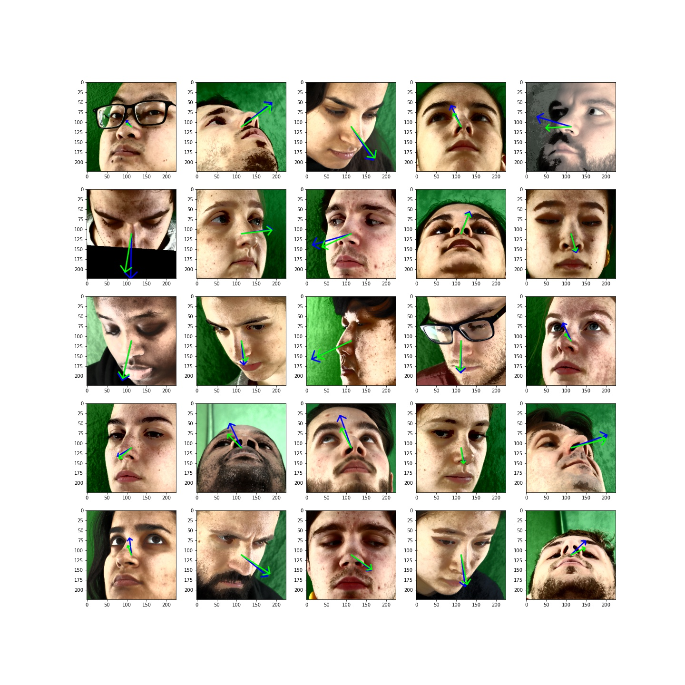
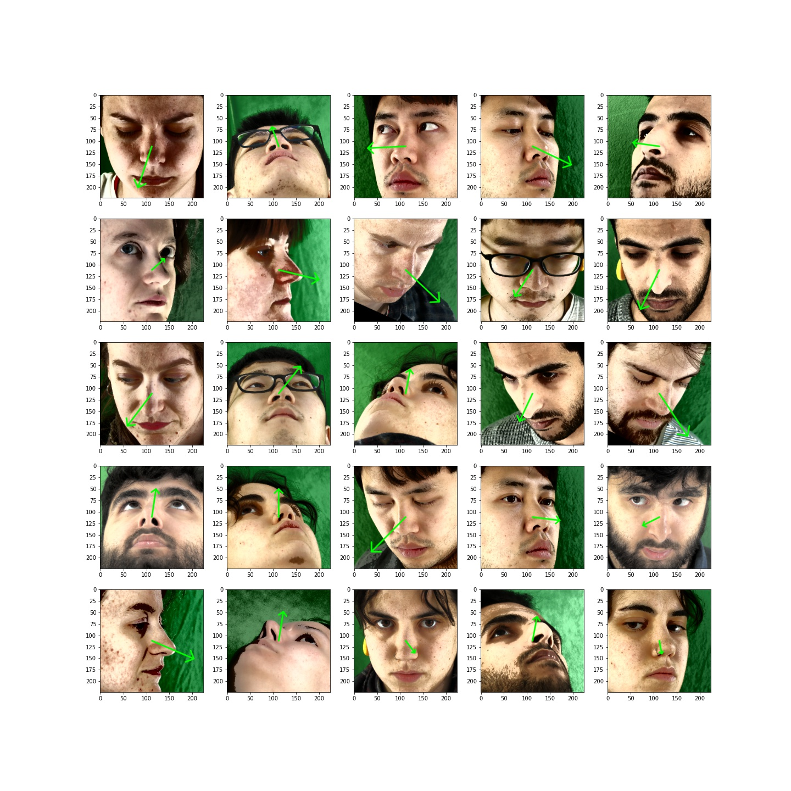

# GazeEstimation
## Run demo

First run ```pip install -r requirements.txt``` to install all necessary modules to run the demo (you may change it if you don't want to update torch, though, I believe, it will work on earlier versions too).

Enjoy your demo : ``` python gaze_estimation.py``` 

(Also, don't forget to download all the weigths and place them into `weights` folder)

## Repository structure 

`SynthesEyes.ipynb` contains step-by-step implementation of 
training environment for [SynthesEyes](https://www.cl.cam.ac.uk/research/rainbow/projects/syntheseyes/) dataset.

`Hourglass.ipynb` contains my implementation of Hourglass neural network, it's training and evaluation for pupil heatmaps extraction.

`Gaze-Estimation-using-XGaze-dataset.ipynb` contains training environment used in order to train and test ResGaze model on XGaze dataset.

`Spatial-Net.ipynb` contains my implementation of DenseNet neural network (paritally) and also SpaNet, which was used to fit XGaze dataset, but no luck - after 50-60 hours of training, it was able to achieve only 10 degrees angular error, and more than that, it was slower than ResGaze.

* `modules` - all implemented models
* `src` - all important helper functions
* `face_detection` - [BlazeNet](https://arxiv.org/pdf/1907.05047.pdf) implementation (it's not mine, but I forgot to save link to source). Allows to predict face bounding box using <1ms time on GPU. Didn't use it in the project, though.

# Algorithms for gaze estimation

## Regression from eye images
| Model                                  | Test Error                    |   Train size/Amount of epochs |   Model size   |
|:---------------------------------------|:-----------------------------:|:-----------------------------:|:---------------|
| GazeNet (7 conv, 1 dense, w/o BN)      |           0.91                |       10240/70                |    8.7 Mb      |
| GazeNet_v2 (7 conv, 2 dense, w/ BN)    |           0.79                |       10240/70                |   15.6 Mb      |

### GazeNet (7 conv, 1 dense, w/o BN) 
Test error is quite big because it represents L1 loss with respect to euler's angles in screen space 
(yaw and pitch, reference point located at pupil center) 

### GazeNet_v2 (8 conv, 2 dense, w/ BN)
Clear underfit, my guess is that it is pretty hard to learn direct mapping from feature space of the image (HxWx3) directly to gaze (just 2 features, it is either point on the screen or two angles in radians). Maybe, we should try to learn intermediate features first.

UPD : Legend is not right, it must be "Train loss and test loss" 


## Pupil landmarks estimation (hence regression from intermediate features)

| Model                                  | Test Error                    | Train size/Amount of epochs |   Model size   | Evaluation time |
|:---------------------------------------|:-----------------------------:|:---------------------------:|:---------------|:----------------|
| PupilNet-3Hourglass w/ BN              |              ~3000            |     10240/153               |       2 Mb     | 52 ms on pretty old InterCore-i5 CPU   |

### PupilNet-3Hourglass-sigma_10 w/ BN

Test error is around 3000, which is actually 3000 / 32 ~ 93.75 per prediction, because I accidentally 
measured it over batch, not over single image. It means that following model gives approximately less than 0.01 error per pixel 
(because one prediction contains 8 heatmaps each of them has 80x120 pixels), which 
is enough to predict valuable heatmaps.


Actual heatmaps of pupil landmarks : 


## Regression directly from face image

### Spa-Net

| Model                                  | Test Error                    | Train size/Amount of epochs |   Model size   | Evaluation time |
|:---------------------------------------|:-----------------------------:|:---------------------------:|:---------------|:----------------|
| Spa-Net : 3Hourglass w/ BN + small DenseNet as the regressor              |              10 degrees angular error on XGaze dataset            |     750k/2.7               |       2 Mb     | 20ms on RTX 3060Ti   |

It was slow, consumed a lot of memory (7.3Gb VRAM, where batch_size was 8) and had bad predictive abilities, though it gave me an idea to use even stronger feature extractor.

### ResGaze

| Model                                  | Test Error                    | Train size/Amount of epochs |   Model size   | Evaluation time |
|:---------------------------------------|:-----------------------------:|:---------------------------:|:---------------|:----------------|
| ResGaze (resnet50 as a backbone + regressor from extracted features)   |             2 degrees (angular error derived from cosine similarity) on XGaze dataset         |     750k/10               |       100 Mb     | 10ms on RTX 3060Ti per sample   |

This simple model is inspired by [RT-GENE](https://openaccess.thecvf.com/content_ECCV_2018/papers/Tobias_Fischer_RT-GENE_Real-Time_Eye_ECCV_2018_paper.pdf) paper, where they used VGG-16 network for feature extraction, and I decided to use Resnet50 to do the job. 

Next pretty import thing, that [XGaze](https://ait.ethz.ch/projects/2020/ETH-XGaze/) dataset was used to train robust gaze predictor. Is was said, that the model was able to achieve angular error of 2 degrees per sample, which is impressive, because this dataset has very rich distribution in sense of head and gaze rotations. 

Train predictions (green is the prediction and blue is a ground truth gaze vector)             |  Test predictons
:-------------------------:|:-------------------------:
|  

## ToDo

• <s> Use pupil features given in the dataset </s> 

• <s> Implement pupil center detection using another dense layer (probably it is just weighted softmax of all heatmaps?) </s>

• Apply augmentation <s> <b> only if </b> model works bad during inference time </s> 

Just took a look at learning curves, model is too weak, so
I think we need stronger feature extraction

• <s> Implement hourglass </s> 

• <s> Explain hourglass error </s>

• <s> Implement softmax over heatmaps in order to predict landmarks coordinates </s>

• Fix inverse affine transform of gaze direction

• Implement face and facial landmarks detection such that it can be executed on GPU
